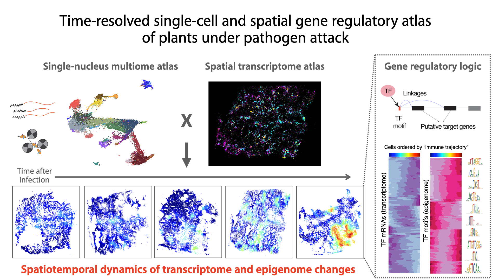

# Time-resolved single-cell and spatial gene regulatory atlas of plants under pathogen attack
This repository contains key scripts used for single-nucleus multiomics (RNA and ATAC) in [Nobori et al., 2023, bioRxiv](https://www.biorxiv.org/content/10.1101/2023.04.10.536170v1)

## **snMultiome analyses**
**[snMultiome_preprocessing_cellranger.sh](scripts/snMultiome_preprocessing_cellranger.sh)**\
cellranger-arc for processing snMultiome raw data

**[0_config_multiome.R](scripts/0_config_multiome.R)**\
This script installs necessary libraries and functions

**[1_qc_data_integration.R](scripts/1_qc_data_integration_figS1.R)**\
QC based on snRNA-seq and snATAC-seq data

**[2_clustering.R](scripts/2_clustering_fig1_figS12.R)**\
Clustering analysis based on snRNA-seq, snATAC-seq, or joint data

**[3_ACR-gene_link_analysis_fig2.R](scripts/3_ACR-gene_link_analysis_fig2.R)**\
Linking mRNA expression and chromatin accessibility

**[4_motif_analysis.R](scripts/4_motif_analysis_fig3.R)**\
Motif enrichment analysis at the single-cell resolution

**[5_subclustering_pseudobulking.R](scripts/5_subclustering_pseudobulking_fig1.R)**\
Sub-clustering analysis of individual major clusters

**[6_gt3a_bulkRNAseq_fig6.R](scripts/6_gt3a_bulkRNAseq_fig6.R)**\
Bulk RNA-seq analysis of a GT-3A overexpression line

**[7_comparison_with_bulk_omics_figS1_figS3.R](scripts/7_comparison_with_bulk_omics_figS1_figS3.R)**\
Comparisons between snRNA-seq/snATAC-seq and bulk RNA-seq/ATACseq

**[8_snRNA-seq_of_gt3aKO_figS8.R](scripts/8_snRNA-seq_of_gt3aKO_figS8.R)**\
snRNA-seq analysis of a GT-3A knowckout mutant 

## **Integration with spatial transcriptomics (MERFISH)**
Please refer to [Spatial_Plant_Pathogen_Atlas](https://github.com/amonell/Spatial_Plant_Pathogen_Atlas.git)

## Contact

- Tatsuya Nobori: :envelope: Tatsuya.Nobori@tsl.ac.uk
